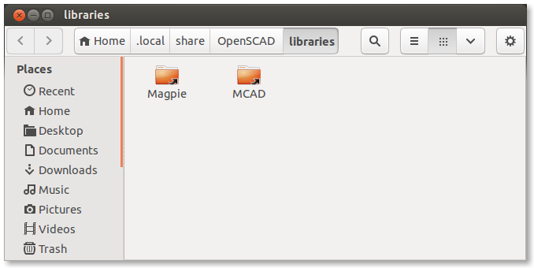

#Magpie Introduction and Library Tutorial
Libraries are powerful tools for encouraging code reuse and common standards, however adding libraries to OpenSCAD was difficult in past releases. With the upcoming 2013.06 release of OpenSCAD, library addition will become significantly easier. This tutorial will take you through the steps of adding libaries, and creating some demo parts with Magpie. Some prior knowledge of OpenSCAD is recommended.

##Adding a library
With versions of OpenSCAD newer than 2013.06, adding libaries is very simple now. If you go to the "File" menu and select "Show Library Folder..." a file browser will appear to let you add your libraries.




You can see I have added MCAD and Magpie to my library folder already. You can now go ahead and copy and paste your library here. Make sure you are careful about what you name the folders because OpenSCAD will search based on file and folder name. Magpie should have a folder named "Magpie", not "Magpie_somehash1234". I have found adding links to the actual folders (represented by the arrow in the lower left corner in Ubuntu) is a good idea if you want to develop your libraries easily. 

##Including Magpie and creating a flat washer
Assuming you took the above steps, you should be ready to begin designing parts with Magpie. Let's start by including Magpie. You can do this by adding `include <Magpie/magpie.scad>;` to the text editor. If you now compile you will see some output with the locations of Magpie modules in the console. OpenSCAD has now cached the code for Magpie modules. We can start by creating a washer. Add `flat_washer("M3");` to your script. You should see a standard M3 flat washer. 


In the console there should be an output line with "MAGPIE: M3 flat washer". You can use output to generate parametric bill of materials. You can try other sizes like M4, M5, M6, and M8, or even another module like `nut()` or `lock_nut()`. See how sizes and console output changes. 

##Magpie layout and Vector Objects
OpenSCAD does not currently have objects or similiar concepts like structs, associative arrays, or dictionarys. Neither does it support mutable variables. We have worked around this by creating some reserved keywords that will enable an object oriented style of design. This works by `include`ing Magpie. The `use` statement will not work as it does not import variables. A favorite example way to use Magpie is shown below. We will use this example to explain vector objects later.
```c
include <Magpie/magpie.scad>;

//configuration
screw = "M4";
length = 10;

//modules
module screw_and_washer(screwType, screwLength){
	flat_washer(screwType);
	cap_screw(screwType,screwLength);
}

//assemblies and sub assemblies
module my_project(screw, length){
	screwObj = object(screw);
	screw_and_washer(screw, length);
	translate([0,0,length-screwObj[NUT_HEIGHT]])nut(screw);
}

my_project(screw,length);
```
The above script is broken into 3 parts. A configuration is what we like to leave to face the user. This is the minimal set of required parameters to design your project. Next the modules define all the parts and sub assemblies in you project. It is handy to keep your variables in module scope so you can use these files in remixes. The final part is rendering and producing the project. This can be done with assemblies and parts that take advantage of the vector objects in Magpie. 
If you look at the `my_project()` module you will see we use the `object()` function to create a screw object from a passed string. This screw object now is a vector containing all the dimensions of an M4 screw in this case. We can access these parameters by using all capital vector index definitions. In this example we used "NUT_HEIGHT". This is why it is necessary to `include` Magpie. The accessable parameters vary between requested objects. You can also directly access the defined objects such as `m3[DIAMETER]`. Links to object lists and modules are below.
* [Object List](./object_list.md)
* [Modules](./modules.md)

